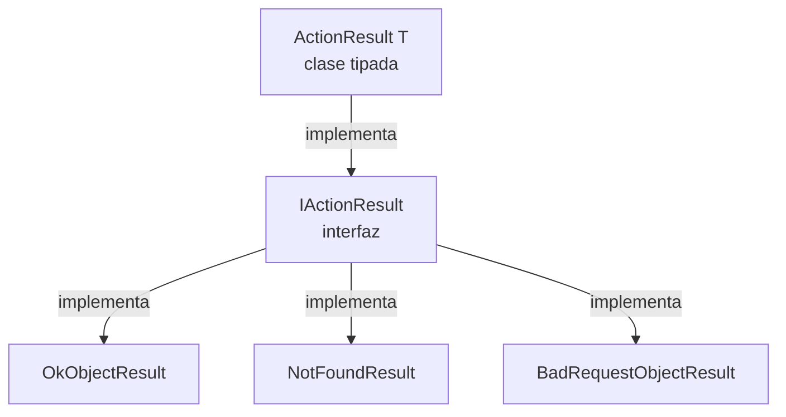

# ASP.NET Core — Controllers

## `[ProducesResponseType]`

```csharp
[HttpGet]
[ProducesResponseType(StatusCodes.Status200OK)]
public IActionResult GetCategories() { ... }
```

No es obligatorio ni cambia el comportamiento en runtime — es **documentación** para Swagger/OpenAPI. Le dice al generador qué status codes puede devolver el endpoint, sin tener que ejecutar el código para descubrirlo.

**Por qué es más necesario con `IActionResult`:** el compilador no puede inferir qué códigos regresa un `IActionResult` (podría ser `Ok()`, `NotFound()`, lo que sea) — con un tipo concreto o `ActionResult<T>`, parte de esa info ya es explícita.

⚠️ **Regla de higiene:** solo documentar los códigos que la lógica del método realmente puede producir. Si el atributo dice `403 Forbidden` pero el código nunca tiene un `return Forbid()`, es inconsistente — quitarlo o agregar la lógica que lo justifique.

---

## `IActionResult` vs `ActionResult<T>`

Ambos representan "el resultado de una acción de Controller". `Ok()`, `NotFound()`, `BadRequest()` regresan clases distintas, pero todas implementan `IActionResult`.



| | `IActionResult` | `ActionResult<T>` |
|---|---|---|
| Sabe el tipo de dato de éxito | No | Sí (`<T>`) |
| Necesita `Ok(dato)` explícito | Sí, siempre | Opcional — puede regresar el objeto directo |
| Documentación en Swagger | Incompleta sin `[ProducesResponseType]` extra | Más completa, sin atributo extra |

```csharp
// IActionResult
public IActionResult GetCategory(int id)
{
    var c = _repo.GetCategory(id);
    if (c == null) return NotFound();
    return Ok(_mapper.Map<CategoryDto>(c));
}

// ActionResult<T> — más moderno, recomendado
public ActionResult<CategoryDto> GetCategory(int id)
{
    var c = _repo.GetCategory(id);
    if (c == null) return NotFound();
    return _mapper.Map<CategoryDto>(c); // válido sin Ok()
}
```

**Importante:** el código HTTP real que recibe el cliente (status + body) es **idéntico** en ambos casos. La diferencia es solo en tiempo de compilación y en la calidad de la documentación generada — nunca en lo que viaja por la red.

---

## Rutas: `[HttpGet("{id:int}", Name = "GetCategory")]`

- `"{id:int}"` → **route constraint**: solo acepta enteros. Si llega `/api/categories/abc`, ni entra al método — ASP.NET responde 404 automático.
- `Name = "GetCategory"` → nombre interno de la ruta, usado para generarla desde otro lado sin escribir el string a mano:

```csharp
return CreatedAtRoute("GetCategory", new { id = category.Id }, category);
```

Esto genera automáticamente la URL del recurso recién creado (header `Location` del `201 Created`), apuntando a la ruta nombrada `"GetCategory"`.
