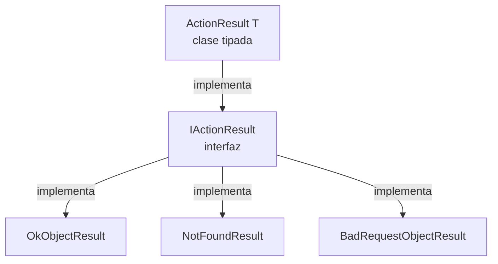

# ASP.NET Core — Controllers

## `[ProducesResponseType]`

```csharp
[HttpGet]
[ProducesResponseType(StatusCodes.Status200OK)]
public IActionResult GetCategories() { ... }
```

No es obligatorio ni cambia el comportamiento en runtime — es **documentación** para Swagger/OpenAPI. Le dice al generador qué status codes puede devolver el endpoint, sin tener que ejecutar el código para descubrirlo.

**Por qué es más necesario con `IActionResult`:** el compilador no puede inferir qué códigos regresa un `IActionResult` (podría ser `Ok()`, `NotFound()`, lo que sea) — con un tipo concreto o `ActionResult<T>`, parte de esa info ya es explícita.

⚠️ **Regla de higiene:** solo documentar los códigos que la lógica del método realmente puede producir. Si el atributo dice `403 Forbidden` pero el código nunca tiene un `return Forbid()`, es inconsistente — quitarlo o agregar la lógica que lo justifique.

---

## `IActionResult` vs `ActionResult<T>`

Ambos representan "el resultado de una acción de Controller". `Ok()`, `NotFound()`, `BadRequest()` regresan clases distintas, pero todas implementan `IActionResult`.



| | `IActionResult` | `ActionResult<T>` |
|---|---|---|
| Sabe el tipo de dato de éxito | No | Sí (`<T>`) |
| Necesita `Ok(dato)` explícito | Sí, siempre | Opcional — puede regresar el objeto directo |
| Documentación en Swagger | Incompleta sin `[ProducesResponseType]` extra | Más completa, sin atributo extra |

```csharp
// IActionResult
public IActionResult GetCategory(int id)
{
    var c = _repo.GetCategory(id);
    if (c == null) return NotFound();
    return Ok(_mapper.Map<CategoryDto>(c));
}

// ActionResult<T> — más moderno, recomendado
public ActionResult<CategoryDto> GetCategory(int id)
{
    var c = _repo.GetCategory(id);
    if (c == null) return NotFound();
    return _mapper.Map<CategoryDto>(c); // válido sin Ok()
}
```

**Importante:** el código HTTP real que recibe el cliente (status + body) es **idéntico** en ambos casos. La diferencia es solo en tiempo de compilación y en la calidad de la documentación generada — nunca en lo que viaja por la red.

---

## Rutas: `[HttpGet("{id:int}", Name = "GetCategory")]`

- `"{id:int}"` → **route constraint**: solo acepta enteros. Si llega `/api/categories/abc`, ni entra al método — ASP.NET responde 404 automático.
- `Name = "GetCategory"` → nombre interno de la ruta, usado para generarla desde otro lado sin escribir el string a mano:

```csharp
return CreatedAtRoute("GetCategory", new { id = category.Id }, category);
```

Esto genera automáticamente la URL del recurso recién creado (header `Location` del `201 Created`), apuntando a la ruta nombrada `"GetCategory"`.

---

## `Name` en las rutas — mecánica completa

`Name` **nunca interviene en el enrutamiento normal** (una petición HTTP directa, tipo `GET /api/categories/1`, se resuelve solo con el template de la ruta — el `Name` no participa ahí). Su único trabajo es servir de identificador para que **otro método del código** pueda generar esa URL dinámicamente, sin escribirla a mano:

```csharp
[HttpGet("{id:int}", Name = "GetCategory")] // 1. declaras el nombre
public IActionResult GetCategory(int id) { ... }

// 2. en otro método, lo referencias como string:
return CreatedAtRoute("GetCategory", new { id = category.Id }, category);
```

Deben coincidir **exactamente** (mismo texto, sensible a mayúsculas). Tres escenarios reales, comprobados:

| Escenario | ¿Cuándo falla? |
|---|---|
| `Name` distinto entre el atributo y el `CreatedAtRoute` que lo busca | En **runtime**, solo al ejecutarse esa línea → `InvalidOperationException: No route matches the supplied values` |
| Dos endpoints con el **mismo `Name` y el mismo template de ruta** | Al **iniciar la app** → `Attribute routes with the same name must have the same template` |
| `Name` distinto en cada endpoint, y nada lo referencia | Nunca falla — el `Name` simplemente no cumple ninguna función, es opcional |

**Regla práctica:** ponle `Name` solo al endpoint que efectivamente vas a referenciar desde otro método (típicamente el GET puntual que consume el POST vía `CreatedAtRoute`). En los demás, es decorativo si nada lo usa.

---

## Route constraint ausente → el parámetro pasa a query string, no desaparece

Si quitas el segmento de ruta (`{id:int}`) pero el método sigue pidiendo `int id`, **no truena** — ASP.NET Core busca automáticamente ese parámetro en el **query string**:

```csharp
[HttpGet("{id:int}")]        // GET /api/Categories/3   → id viene del PATH
public IActionResult GetCategory(int id) { ... }

[HttpGet]                     // GET /api/Categories?id=3 → id viene del QUERY STRING
public IActionResult GetCategory(int id) { ... }
```

Swagger simplemente **refleja fielmente** cuál de las dos formas define tu código (`(path)` o `(query)`) — no decide nada por su cuenta.

⚠️ **Riesgo real de "error silencioso":** si alguien borra `{id:int}` sin querer (mal merge, copy-paste incompleto), el proyecto sigue compilando, arrancando y respondiendo `200 OK` — solo que la URL "correcta" cambió de `/Categories/3` a `/Categories?id=3` sin que nadie lo haya decidido. El frontend, que ya esperaba el patrón anterior, empieza a recibir `404` sin ningún error visible del lado del backend. Se detecta con tests de integración que prueben la URL exacta, o con code review atento.

**Nota sobre constraints válidos:** `:int`, `:bool`, `:guid`, `:datetime`, `:alpha` sí existen. `:string` **no existe** como constraint — no hace falta, porque sin ningún constraint, la ruta ya acepta cualquier texto por default. Ponerlo (`{id:string}`) tira error al iniciar la app: `The constraint reference 'string' could not be resolved to a type`.

**Constraint y tipo del parámetro deben coincidir:** si la ruta dice `{id:bool}` pero el método espera `int id`, el constraint sí deja pasar valores booleanos (`true`/`false`) pero luego el model binding falla al convertir eso a `int` → `400 Bad Request`.

---

## Path vs Query string — cuál usar para cada parámetro

| Tipo de parámetro | Dónde va | Ejemplo |
|---|---|---|
| Identifica un recurso específico (el "cuál") | Path | `GET /Categories/{id}` |
| Filtra, ordena, pagina, o cambia el formato de respuesta (el "cómo") | Query string | `GET /Categories?active=true&page=2` |
| Datos completos a crear/actualizar | Body (`[FromBody]`) | nunca en la URL |

**Anidación de recursos** (`/Categories/{categoryId}/products/{productId}`) solo tiene sentido cuando el hijo **pertenece conceptualmente** al padre y se está pidiendo la colección relacionada (`GET /Categories/3/products` → "productos DE la categoría 3"). Si el recurso hijo tiene un `Id` único global (lo normal con autoincremental de SQL Server), acceder a él directo es más simple y correcto: `GET /Products/7`, sin anidar nada.

El frontend sabe qué va en cada parámetro por el **contrato documentado** (Swagger/OpenAPI, Postman Collection compartida, o acuerdo previo del equipo) — nunca lo adivina.

### Analogía con sobrecarga de métodos en C#

Es un paralelismo válido, pero el mecanismo real es distinto:

| | Sobrecarga en C# | Rutas en ASP.NET Core |
|---|---|---|
| Qué distingue cuál se ejecuta | Tipos y cantidad de parámetros en la firma | Verbo HTTP + template de ruta |
| Cuándo se resuelve | Tiempo de compilación | Tiempo de ejecución (por cada request) |
| El nombre del método importa | Sí, debe ser el mismo | No — puede llamarse distinto, lo que importa es el `Name`/template |
| Ejemplo válido | `Procesar(int id)` y `Procesar(string id)` — distingue por **tipo** | `[HttpGet]` y `[HttpGet("{id:int}")]` — distingue por **template**, no por tipo |

**Diferencia clave:** en HTTP, todo llega como texto (la URL siempre es un string) — no existe "sobrecarga por tipo" en rutas. Dos rutas con el mismo verbo y el mismo template pero pensadas para "tipos" distintos de parámetro (ej. `{id:int}` vs `{id}` sin constraint aceptando cualquier string) son **ambiguas** y chocan, a diferencia de C# donde el compilador sí puede distinguir `int` de `string` sin problema. Lo que realmente distingue rutas es la **estructura literal de la URL** (segmentos fijos, como `by-code/{codigo}`), no el tipo del valor que reciben.

---

## PATCH vs PUT

| | `PUT` | `PATCH` |
|---|---|---|
| Qué reemplaza | El recurso completo | Solo los campos enviados |
| Campo omitido | Se borra / va a su default | No se toca |

⚠️ Ojo: usar `[HttpPatch]` en el atributo, pero mapear el body completo con un DTO que trae todas las propiedades (como `CreateCategoryDto`) y reemplazarlas todas, es un PATCH "de nombre" pero un PUT "de comportamiento" — un PATCH real recibe algo tipo `JsonPatchDocument<T>` con operaciones puntuales (`replace`, `add`, `remove`), o un DTO donde los campos no enviados quedan `null` y se ignoran explícitamente.

---

## Orden recomendado de `[ProducesResponseType]`

No hay estándar oficial (no afecta nada funcional, cualquier orden compila y corre igual) — la convención más común: éxito primero, luego errores de cliente (4xx) antes que errores de servidor (5xx):

```csharp
[ProducesResponseType(StatusCodes.Status200OK)]
[ProducesResponseType(StatusCodes.Status400BadRequest)]
[ProducesResponseType(StatusCodes.Status401Unauthorized)]
[ProducesResponseType(StatusCodes.Status404NotFound)]
[ProducesResponseType(StatusCodes.Status500InternalServerError)]
```

Lo que sí importa de verdad: que los códigos declarados **coincidan con lo que el método realmente puede devolver** (si dice `403` pero nunca hay `return Forbid()`, es ruido/inconsistencia).

---

## `ModelState.AddModelError` con key personalizada (patrón "CustomError")

```csharp
ModelState.AddModelError("CustomError", $"Algo salió mal al eliminar la categoría {category.Name}");
return StatusCode(500, ModelState);
```

`ModelState` está pensado para errores de validación de campos (donde la key normalmente es el nombre del campo que falló). Aquí se reutiliza con una key inventada (`"CustomError"`) para reportar un error genérico del servidor. Serializa a JSON así:

```json
{ "CustomError": ["Algo salió mal al eliminar la categoría Ropa"] }
```

⚠️ **Riesgo:** la key es un string libre — un typo (`"CustomeError"`, minúsculas distintas) **no rompe el backend** (compila y responde igual), pero rompe silenciosamente al frontend si este espera una key específica y no la encuentra (`errorData.CustomError` → `undefined`). Sin ningún error visible del lado del servidor.

**Mitigación:** centralizar el string en una constante, para que un typo sea error de compilación en vez de bug silencioso en producción:
```csharp
private const string CustomErrorKey = "CustomError";
```

**Alternativa más estándar** (evita reutilizar `ModelState` fuera de su propósito): usar `ProblemDetails`, el mismo formato que ASP.NET Core ya genera automáticamente en sus 400 automáticos.
