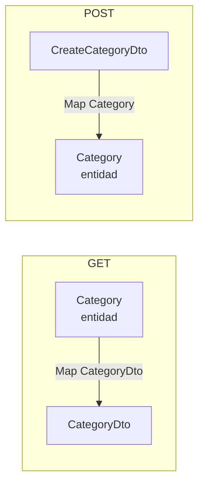

# DTOs y AutoMapper

## Por qué separar Entidad de DTO (aunque tengan las mismas propiedades)

| | Entidad (`Category`) | DTO (`CategoryDto`) |
|---|---|---|
| Representa | Cómo se guarda en la BD | Cómo se expone al cliente/API |
| Quién la controla | El esquema de la base de datos | Tú, explícitamente |

**Analogía:** la entidad es la cocina de un restaurante (ingredientes internos, procesos, cambios de proveedor); el DTO es el menú (lo curado y estable que el cliente ve).

### Qué pasa si NO se separan (se expone la entidad directo)

```csharp
[HttpGet]
public IActionResult GetCategories() => Ok(_db.Categories.ToList()); // ⚠️
```

1. **Expone datos que no deberían ser públicos** (notas internas, IDs de auditoría, etc.).
2. **Rompe el contrato de la API sin darte cuenta** — si el equipo agrega una relación nueva a la entidad, el endpoint empieza a devolver datos extra sin que nadie lo decidiera explícitamente.
3. **Riesgo de over-posting** — en un POST con la entidad como parámetro directo, alguien podría mandar en el JSON campos que no debería poder setear (ej. un `Id` o un campo sensible).

**Regla:** siempre separar DTO de entidad en proyectos de API, incluso si hoy son idénticos — es cuestión de tiempo antes de que dejen de serlo.

---

## AutoMapper

> Nota: AutoMapper pasó a licencia de paga para uso comercial (a partir de cierta versión). Si el proyecto no lo sigue usando, alternativas: mapeo manual (constructor/método de extensión), o librerías gratuitas como **Mapster**. La lógica de "por qué separar DTO/entidad" de este documento sigue aplicando igual, sin importar la herramienta de mapeo.

### `CreateMap` y `.ReverseMap()`

```csharp
public class CategoryProfile : Profile
{
    public CategoryProfile()
    {
        CreateMap<Category, CategoryDto>().ReverseMap();
        CreateMap<CreateCategoryDto, Category>().ReverseMap();
    }
}
```

- `CreateMap<A, B>()` → enseña a convertir `A → B`.
- `.ReverseMap()` → además genera automáticamente `B → A`, sin tener que declararlo aparte.

**Analogía:** `Profile` es un traductor bilingüe. `CreateMap<A, B>()` es enseñarle "cuando te hablen en A, tradúcelo a B". `.ReverseMap()` es "y también al revés".

⚠️ Importante: si ya existe `CreateMap<CreateCategoryDto, Category>()`, esa dirección **ya funciona sola**, sin necesitar el `.ReverseMap()`. El `.ReverseMap()` solo agrega la dirección contraria (`Category → CreateCategoryDto`), que puede no usarse en el código actual — se deja "por si acaso" se necesita después.

### Dirección del mapeo según el flujo (regla clave)

| Endpoint | Dirección | Por qué |
|---|---|---|
| GET (`GetCategory`) | `Category → CategoryDto` | Los datos **salen** de la API hacia el cliente |
| POST (`CreateCategory`) | `CreateCategoryDto → Category` | Los datos **entran** desde el cliente, hay que convertirlos a entidad para guardar con EF Core |

```csharp
// Sintaxis: Map<TIPO_DESTINO>(objetoOrigen)
_mapper.Map<CategoryDto>(category);        // GET:  entidad -> DTO
_mapper.Map<Category>(createCategoryDto);  // POST: DTO -> entidad
```



### Por qué existen DTOs distintos para leer y crear (`CategoryDto` vs `CreateCategoryDto`)

No todos los DTOs tienen las mismas propiedades:

| DTO | Propósito | Diferencia típica |
|---|---|---|
| `CategoryDto` | Mostrar datos (GET) | Incluye `Id`, quizás fecha de creación |
| `CreateCategoryDto` | Recibir datos para crear (POST) | Sin `Id` (lo genera la BD), sin campos generados por el sistema |
