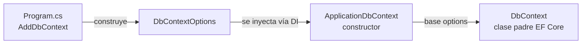

# EF Core — Fundamentos y Migraciones

## ¿Qué hace `base(options)` en el `DbContext`?

```csharp
namespace api_ecommerce.Data
{
    public class ApplicationDbContext : DbContext
    {
        public ApplicationDbContext(DbContextOptions<ApplicationDbContext> options) : base(options)
        {
        }

        public DbSet<Category> Categories { get; set; }
    }
}
```

`ApplicationDbContext` hereda de `DbContext`. La clase padre (`DbContext`) tiene un constructor que **requiere** `DbContextOptions` para saber cómo conectarse a la BD. `: base(options)` le pasa ese dato al constructor del padre antes de ejecutar el cuerpo del tuyo.

**Analogía:** `DbContext` es como una receta base que dice *"para cocinar necesito que me digas primero con qué ingredientes vas a trabajar"*. `base(options)` es entregarle esos ingredientes.

### ¿Por qué al inspeccionar `DbContext` (F12) no aparece mi `Program.cs`?

Son dos herramientas distintas:

| Acción | Qué muestra |
|---|---|
| **Ir a definición** (F12) sobre `DbContext` | El código fuente de la clase `DbContext` dentro de EF Core (no sabe nada de tu proyecto) |
| **Buscar todas las referencias** (Shift+F12) sobre `ApplicationDbContext` | Todos los lugares de **tu proyecto** donde se usa, incluyendo `Program.cs` |

`DbContext` es una clase genérica reutilizable por cualquier proyecto — no "conoce" a quien la usa. La conexión real ocurre por **inyección de dependencias**:

```csharp
// Program.cs
builder.Services.AddDbContext<ApplicationDbContext>(options =>
    options.UseSqlServer(builder.Configuration.GetConnectionString("DefaultConnection")));
```



---

## Migraciones — CLI vs Package Manager Console

Dos formas de ejecutar los mismos comandos, según el entorno:

| Terminal (`dotnet ef`) — multiplataforma | PM> (Visual Studio, solo Windows) |
|---|---|
| `dotnet ef migrations add InitialMigration` | `Add-Migration InitialMigration` |
| `dotnet ef database update` | `Update-Database` |
| `dotnet ef migrations remove` | `Remove-Migration` |
| `dotnet ef database update 0` | `Update-Database 0` |
| `dotnet ef migrations list` | `Get-Migration` |

**Recomendación:** usar `dotnet ef` (CLI) — es multiplataforma, es lo que usan pipelines de CI/CD, y funciona igual sin importar el editor (VS, VS Code, terminal). Instalar una sola vez:
```bash
dotnet tool install --global dotnet-ef
```

### Revertir una migración ya aplicada

Si sale el error *"The migration has already been applied to the database. Revert it and try again"*, es porque `migrations remove` se niega a borrar el archivo si ya está en `__EFMigrationsHistory` (evita desincronizar código y BD).

**Si estás en desarrollo, sin datos importantes que perder:**
```bash
# 1. Regresa la BD al estado sin esa migración
dotnet ef database update 0
# (o Update-Database 0 en PM>)

# 2. Ahora sí, elimina el archivo
dotnet ef migrations remove
# (o Remove-Migration en PM>)
```

**Si la migración ya está en una BD compartida (equipo/staging):** no la borres — crea una nueva migración que revierta los cambios:
```bash
dotnet ef migrations add RevertInitialMigration
```

**Tip PM>:** verificar que el dropdown **"Default project"** apunte al proyecto donde vive el `DbContext`, o falla aunque el comando esté bien escrito.
