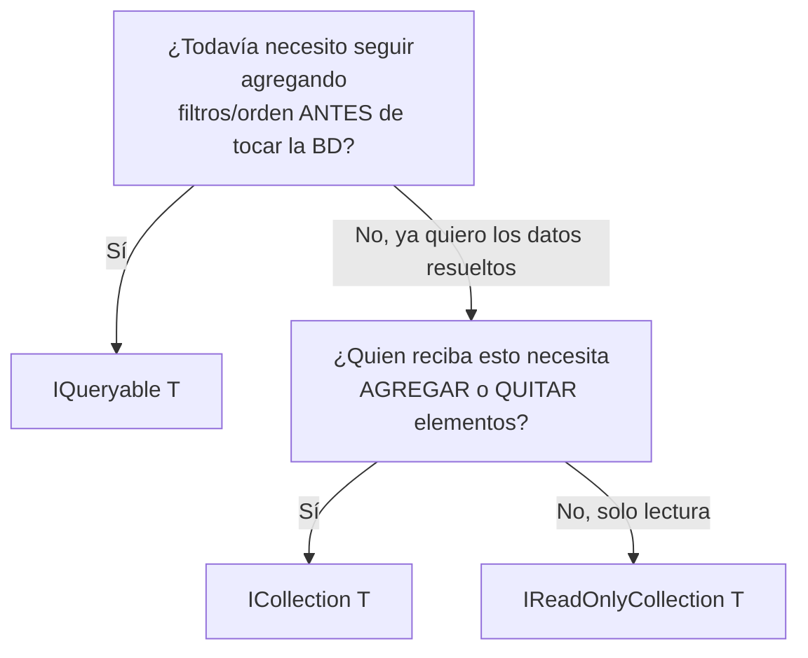

# LINQ — Materializar Consultas y Tipos de Retorno

## ¿Qué es "materializar"?

**Materializar** = ejecutar la consulta contra la BD y traer los resultados a memoria como una colección concreta, en vez de dejarla como una "promesa" de consulta diferida.

```csharp
_db.Categories.OrderBy(c => c.Name)          // NO ha tocado la BD todavía (IQueryable, diferido)
_db.Categories.OrderBy(c => c.Name).ToList() // AQUÍ se ejecuta el SELECT y trae los datos (materializado)
```

**Analogía:** `IQueryable` es una orden en un restaurante aún no cocinada — solo la instrucción de qué vas a pedir. `.ToList()` es cuando el mesero se la lleva a la cocina, se prepara, y te la trae servida en un plato.

### Por qué importa

| Sin materializar (`IQueryable`, ejecución diferida) | Materializado (`.ToList()`) |
|---|---|
| No se ejecuta hasta que se itera | Se ejecuta de inmediato |
| Riesgo: si el `DbContext` ya se cerró antes de iterar, truena | Seguro — ya tienes los datos resueltos |
| Permite seguir encadenando `.Where()`, `.Take()` — se traduce a SQL | Filtrar después ya sería en memoria, no en SQL |

---

## `IQueryable` vs `IEnumerable` vs `ICollection` vs `IReadOnlyCollection`

Árbol de decisión:



| Tipo | ¿Materializado? | Cuándo usarlo |
|---|---|---|
| `IQueryable<T>` | No (diferido) | Capa interna que aún compone la consulta (filtros, paginación) |
| `IEnumerable<T>` | Ambiguo — genera confusión | Mejor como **parámetro de entrada**, no como retorno de Repository |
| `ICollection<T>` | Sí | Cuando quien recibe legítimamente necesita `.Add()`/`.Remove()` — con o sin BD de por medio |
| `IReadOnlyCollection<T>` | Sí | **La mejor opción para un `GetAll()` de Repository** — dice "ya está resuelto, no lo modifiques" |

```csharp
// Recomendado para un método de solo lectura
public IReadOnlyCollection<Category> GetCategories()
{
    return _db.Categories.OrderBy(c => c.Name).ToList();
}
```

### `ICollection<T>` no es exclusivo de EF Core

Es un tipo genérico de C# (`System.Collections.Generic`), existe desde antes de EF Core. EF Core lo usa mucho para **propiedades de navegación** (relaciones), porque necesita que sea modificable para trackear cambios:

```csharp
public class Category
{
    public ICollection<Product> Products { get; set; } = new List<Product>();
}

category.Products.Add(nuevoProducto); // EF Core SÍ detecta esto
_db.SaveChanges();                     // se inserta el producto relacionado
```

Pero también aplica a colecciones en memoria puras, sin BD de por medio (ej: acumular errores de validación en un builder).

---

## Por qué exponer `ICollection` como retorno de consulta es riesgoso

Ejemplo (carrito de compras, sin EF Core, solo para ver el problema de raíz):

```csharp
public class CarritoCompras
{
    private ICollection<string> _productos = new List<string>();

    public void AgregarProducto(string nombre)
    {
        if (string.IsNullOrWhiteSpace(nombre)) throw new ArgumentException("Nombre vacío");
        _productos.Add(nombre);
    }

    public ICollection<string> ObtenerProductos() => _productos; // ⚠️ expone la MISMA referencia
}
```

```csharp
var productos = carrito.ObtenerProductos();
productos.Add("Mouse"); // se salta TODAS las validaciones de AgregarProducto()
```

`ObtenerProductos()` no regresa una copia — regresa la **misma referencia** en memoria que `_productos`. Cualquiera puede modificarla directo, sin pasar por las reglas de negocio del método `AgregarProducto()`. Esto rompe el **encapsulamiento**.

**Corrección:**
```csharp
public IReadOnlyCollection<string> ObtenerProductos() => _productos.ToList(); // copia de solo lectura
```
Ahora `productos.Add(...)` ni compila, y aunque se forzara un cast, sería sobre una copia — no afecta el estado real del carrito.

**Regla general:** si una clase tiene un método específico para modificar su estado, nunca expongas ese estado de forma que se pueda modificar por otro camino.
